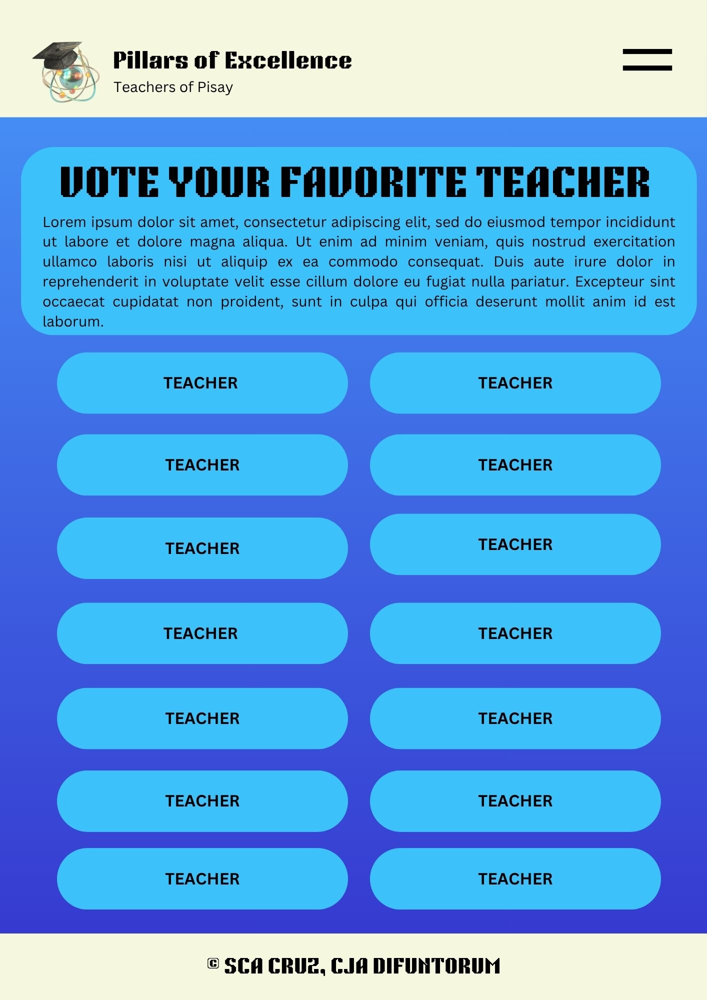

# WDProjMgCruz-Difuntorum
## Pillars of Excellence
### Logo:

 

### Description

This webpage aims to provide a comprehensive overview of the subject units of teachers in PSHS-MC (Pisay). It seeks to highlight their background as teachers, some facts about them and some of their achievements in Pisay. This webpage also aims to discover which among the teachers is the favorite teacher of the Pisay student body through a voting process incorporated in the website itself.  Aside from this, the purpose of the website is to serve as a platform of appreciation to the dedication of Pisay teachers who uses their time to teach and to inspire students. Ultimately, this website hopes to strengthen the awareness and appreciation of students for the teachers themselves.

 

### Webpage Breakdown:

Home Page: Upon opening the website, the user will be directed to a screen with the title of the website and a button to redirect them to the main page.

Main Page: The main page features the explanation to the image and carousel of as well as three buttons that will redirect the user to its respective page: teachers, votes for your favorite teacher, and view the leaderboard.

Teachers Page: This page has the background of the teachers page and a list of each unit. Upon click each unit name, it will redirect the user to the respective units’ page.

Unit Pages: Each unit will have their own respective pages. In this page is information about the unit as a whole (such as but not limited to: favorite place in PISAY, favorite batch to teach, etc.). Here as well are all the last names of each teachers in that unit. Upon clicking each teacher, their full name, picture, and the batch they teach will pop up in a side box.

Vote for Teachers Page: Here the user will be able to vote for their favorite teacher.

Leadership Board Page: This board will show the leading teachers in terms of votes from the voting page.

#### Other Notes:
* Each subpage header has a dropdown menu at the side. Upon clicking it, options of each major subpage (Homepage, Voting Page, Teachers' Page, and Leaderboard) will appear. On this header as well to the right is the logo and name of website.

* Footer will just add the copyright for authors.

 

### Use of Javascript
 
Javascript wil be used in order to maintain the voting and leadership board. JS will keep trach of which teacher a user selects using buttons. It will then store that vote temporarily, show a confirmation pop-up after a vote is submitted, then ultimately, update vote counts in real-time on the page. JS will then rank and configure all the votes to display them in an orderly manner on the leaderboard page.

 

## Wireframes

### Home Page:

### Main Page:

### Teachers Page:

### Unit Pages:

### Unit Pages (Expanded):
.jpg>)

### Vote for Teachers Page:

### Leadership Board Page:

### Link to Canva File (Website Outline)
* https://www.canva.com/design/DAG2m9jMY1c/H4ORVf9WHcBgwpPdbov-6Q/edit?utm_content=DAG2m9jMY1c&utm_campaign=designshare&utm_medium=link2&utm_source=sharebutton
