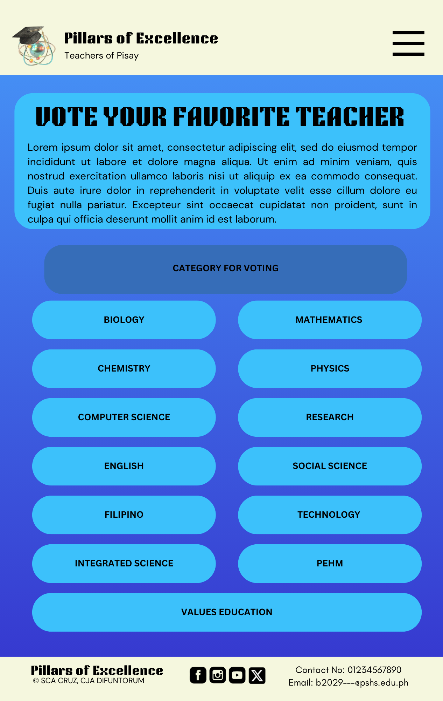

# WDProjMgCruz-Difuntorum
## Pillars of Excellence
### Logo:

 

### Description

This webpage aims to provide a comprehensive overview of the subject units of teachers in PSHS-MC (Pisay). It seeks to highlight their background as teachers, some facts about them and some of their achievements in Pisay. This webpage also aims to discover which among the teachers is the favorite teacher of the Pisay student body through a voting process incorporated in the website itself.  Aside from this, the purpose of the website is to serve as a platform of appreciation to the dedication of Pisay teachers who uses their time to teach and to inspire students. Ultimately, this website hopes to strengthen the awareness and appreciation of students for the teachers themselves.

 

### Webpage Breakdown:

•__Home Page__: Upon opening the website, the user will be directed to a screen with the title of the website and a button to redirect them to the main page.

•__Main Page__: The main page features the explanation to the image and carousel of as well as three buttons that will redirect the user to its respective page: teachers, votes for your favorite teacher, and view the leaderboard.

•__Teachers' Page__: This page has the background of the teachers page and a list of each unit. Upon clicking a respective unit name, it will redirect the user to the respective units’ page.

•__Unit Pages__: Each unit will have their own respective pages. In this page is information about the unit as a whole (such as but not limited to: favorite place in PISAY, favorite batch to teach, etc.). The pieces of information to be displayed here will be based off the reponse of the unit as a _whole_ not individual responses from each teacher. Here as well are all the last names of each teachers in that unit. Upon clicking each teacher, their full name, picture, and the batch(es) they teach will pop up in a side box.

•__Vote for Teacher's Page__: Here the user will be able to vote for their favorite teacher. There will be various cateogries to vote upon, such as, but not limited to: Best Teacher (overall), Best Presentations, Best Handwriting, etc.

•__Leader Board Page__: This board will show the leading teachers in terms of votes based from the voting page. The top 3 best teachers (overall), based on the respones will be displayed with their names and photos. Upon scrolling down, the user will be able to see the top 3 teachers of each category of voting as well.

#### Other Notes:
* __Header__: Each subpage header has a dropdown menu at the side. Upon clicking it, options of each major subpage (Homepage, Voting Page, Teachers' Page, and Leaderboard) will appear. To the left as well is the logo and name of the website.
* __Footer__: Footer contain the copyright for authors and icons of social media icons, of which will redirect users to the corresponding PSHS Main Campus' social media page.

 

### Use of Javascript
 
Javascript wil be used in order to maintain the voting and leadership board. JS will keep trach of which teacher a user selects using buttons. It will then store that vote temporarily, show a confirmation pop-up after a vote is submitted, then ultimately, update vote counts in real-time on the page. JS will then rank and configure all the votes to display them in an orderly manner on the leaderboard page.

 

## Wireframes

### Home Page:

### Main Page:

### Teachers Page:

### Unit Pages:

### Unit Pages (Expanded):
.png>)

### Dropdown Menu (Expanded):

### Vote for Teachers Page (Main Page):

### Vote for Teachers Page (Dropdown of Teachers):

### Vote for Teachers Page (Confirmation of Initial Vote):

### Vote for Teachers Page (Confirmation of Final Vote):

### Leadership Board Page:

### Link to Canva File (Website Outline)
* https://www.canva.com/design/DAG2m9jMY1c/H4ORVf9WHcBgwpPdbov-6Q/edit?utm_content=DAG2m9jMY1c&utm_campaign=designshare&utm_medium=link2&utm_source=sharebutton
